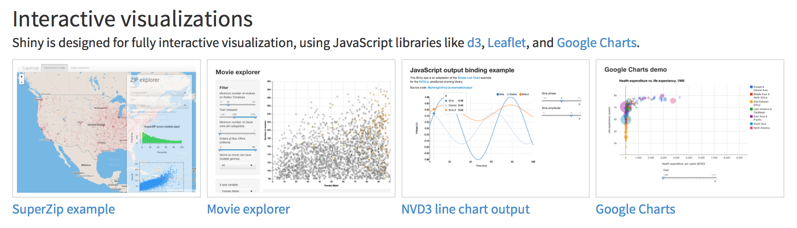
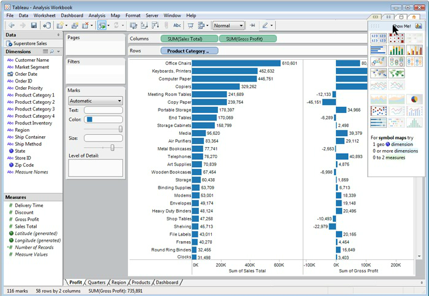
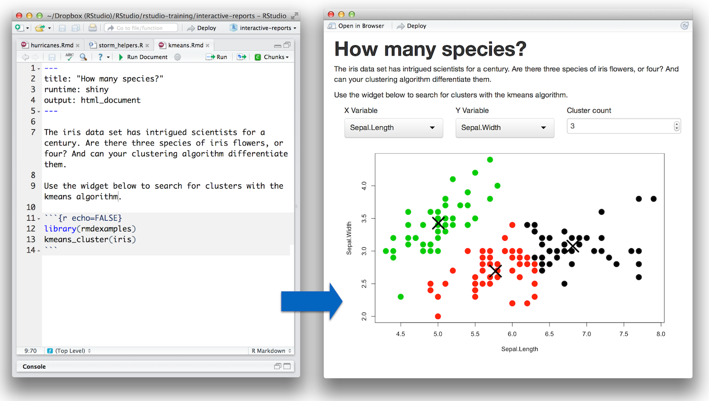
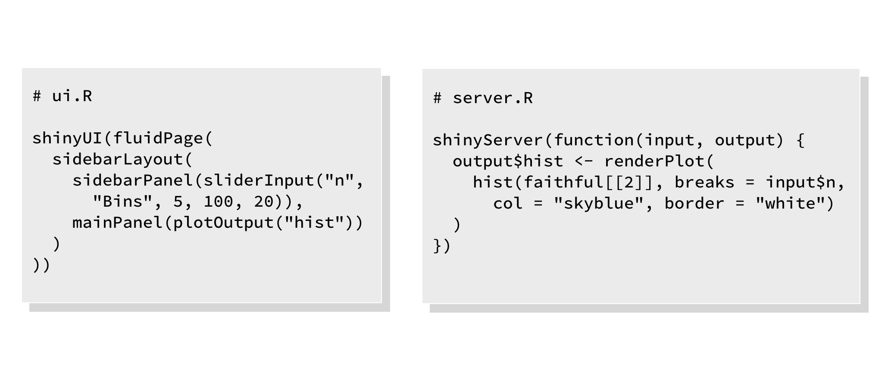
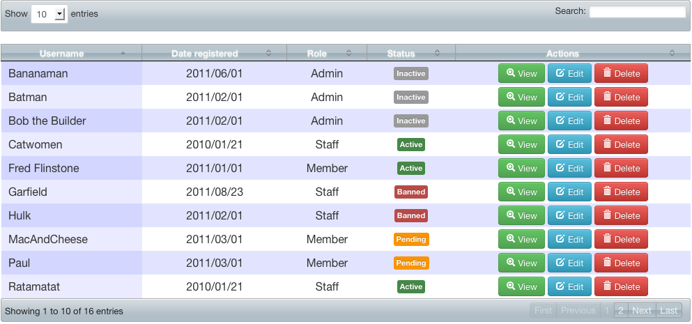
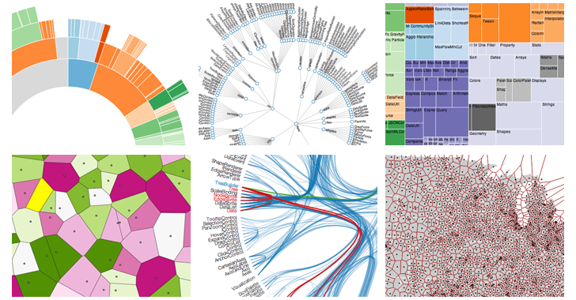
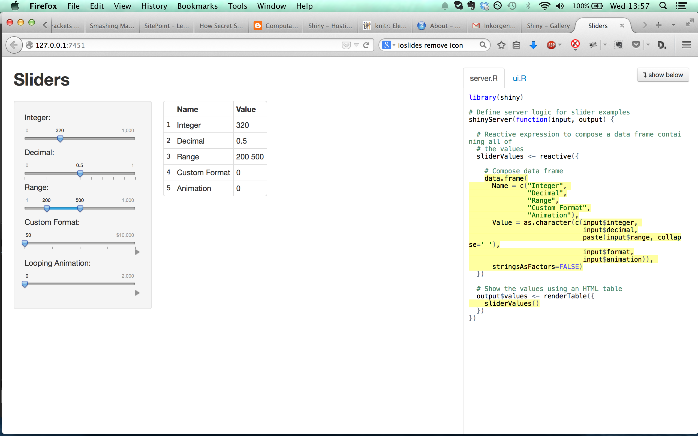

## Vad är Shiny?

I modern statistikrapportering har gränsen mellan presentationsverktyg, webbrowsing, statistisk programmering och bildhantering blivit mycket suddig. 

*Shiny* är ett ramverk som ger R-programmerare möjligheten att integrera samtliga dessa komponenter via R.




## Ett web-framework med fyrverkerier

Många användningsområden:

- Informationsportaler
- Presentationer med live-data, interaktiv grafik m.m.
- Generera PDF, Word-dokument, webbsidor m.m.

<iframe src="http://spark.rstudio.com/trestletech/globePopulation/" height='200' width = '200'></iframe>


## {.flexbox .vcenter}

<h1>Användningsfall</h1>


## Ett ramverk, inte en app

Shiny är ett _ramverk_, inte en _app_.

<br/>

<div class="columns-2">

<small>WYSIWYG-appar: *Tableau* eller Excel</small>


<small>Ramverk: *Shiny* eller Reporting Services</small>
</div>


## Ett programmeringsverktyg

- Shiny är ett verktyg för _programmatisk_ styrning av rapporter, webbsidor, presentationer
- Verktyg som Excel eller Tableau kräver att användaren lär sig ett fördefinierat gränssnitt för att kunna generera rapporter
- Shiny kräver att användaren lär sig programmering och grundläggande designprinciper




## Styrkor med en programmeringsapproach

En programmerare har mycket lätt att komma igång med Shiny. Flera dataförädlare och utvecklare på avdelningen har redan börjat använda ramverket för att lösa mindre uppgifter.

Shiny är ett ramverk som gör det lätt att skriva elegant och funktionell kod. Det är exceptionellt väldokumenterat och har talrika exempel och guider. Det gör att det går mycket snabbt att både komma igång och lära sig mer.

Shiny är en attraktiv metod för att komma igång med webbaserad programmering, vilket senare kan utvidgas med JavaScript och HTML5. Detta gör att vana Shiny-programmerare har nästan obegränsade möjligheter att utveckla helt skräddarsydda statistikprodukter oavsett behov.


## Svagheter med kodbaserad rapportering

Ett verktyg som Excel eller Tableau gör det svårt för användaren att göra "fel". Allt som produceras i sådana verktyg ser ungefär likadant ut och bär omisskänliga visuella spår från det verktyg de producerats med.

Shiny gör det lätt att göra fel. Det ställer betydligt högre krav på kompetens i t.ex. design och visuell kommunikation.

En WYSIWYG-approach gör det möjligt att bara "sätta igång" med t.ex. en presentation eller liknande, medan en kodbaserad approach kräver ett visst mått av abstraktion.

Interaktiv grafik i presentationer och rapporter kräver en R-serversession för att fungera. Det gör att portabiliteten i Shiny-produkter i vissa specialfall är beroende av en fungerandeinternetuppkoppling.


## {.flexbox .vcenter}

<h1>Tekniska specifikationer</h1>


## En frontend för R

- I grunden är Shiny en metod för att hämta data och grafik från en R-session och visa den för en slutanvändare i ett webbrowservänligt format
- Det betyder att _allt som kan göras i R_ kan visas med Shiny
- Resultat kan även användas för att generera rapporter, publikationer, presentationer (som denna)


## R och JavaScript

- Shiny är en plattform för frontend-kodning som baseras på JavaScript-generering från R-kod. Detta innebär att en R-programmerare med lätthet kan utnyttja styrkan i flera kraftfulla .js-bibliotek som t.ex. DataTables, D3.js, Leaflet, ioSlides m.fl.
- JavaScript-programmerare kan lätt skriva egna plugins för Shiny med minimal R-kod.

<div class="columns-2">



</div>


## Interaktiv, länkbar grafik

```{r, echo=FALSE, warning=FALSE, message=FALSE}
require(shiny)
require(ggvis)
require(ggplot2)

shinyApp(
  ui = fluidPage(
    responsive = FALSE,
    
    fluidRow(
      column(6, ggvisOutput('plot1')),
      column(6, 
             ggvisOutput('plot2')
             # ggvisOutput('plot3')
             )
      )
    ),
  
  server = function(input, output, session) {
    
    # Combine the selected variables into a new data frame
    dta <- reactive({
      if (sum(lb$selected()) < 2)
        quakes
      else
        quakes[lb$selected(), ]
      })
    ndta <- reactive(quakes[lb$selected(), ])
    
    lb <- linked_brush(keys = 1:nrow(quakes), "blue")
    
    quakes %>%
      ggvis(~depth, ~mag, fill = ~stations) %>%
      layer_points(size.brush := 200) %>%
      lb$input() %>%
      layer_points(fill := "red", data = ndta) %>%
      hide_legend("fill") %>%
      bind_shiny("plot1")
    
    quakes %>%
      ggvis(~lat, ~long, fill = ~stations) %>%
      layer_points(size.brush := 200) %>%
      lb$input() %>%
      layer_points(fill := "red", data = ndta) %>%
      hide_legend("fill") %>%
      # set_options(height = 200, width = 300, keep_aspect = TRUE) %>%
      bind_shiny("plot2", "plot2_ui")

    dta %>%
      ggvis(~stations) %>%
      layer_densities(fill := "red") %>%
      hide_legend("fill") %>%
      set_options(height = 200, width = 300, keep_aspect = TRUE) %>%
      bind_shiny("plot3", "plot3_ui")
    
    output$dTbl <- renderTable({
      mtcars
      })
    options = list(height = 400)
    }
  )

```


## Det är lätt att återanvända kod

```{r, echo=FALSE, message=FALSE}
source("prepInlineApp.R")
prepInlineApp()
```


## Ytterligare funktionalitet i urval

Inspektera kod

```{r}
summary(cars)
```


## Ytterligare funktionalitet i urval

Inbyggd debugger och visningsläge som visar vilken kod som körs när gör utveckling och felsökning lätt och roligt




## Väldokumenterad plattform

- Shiny är open source och utvecklas av RStudio. Plattformen är exceptionellt väldokumenterad.
- Dokumentationen innefattar såväl en välstädad API-dokumentation som lathundar och en effektiv tutorial, m.m.
- StackOverflow och Google Groups är välförsedda med lösningar på vanliga programmeringsproblem för Shiny.


## Produktionssättning

Produktionssättning av interaktiva Shiny-produkter kan ske på flera sätt:

- Publicering på online-tjänster
- Körning direkt i R (kräver R installerat)
- Egen lösning med produkten Shiny Server, lokalt eller som molntjänst


## Säkerhet

Säkerhet i Shiny är bara så bra som säkerheten i åtkomsten till det system där Shiny körs.

För att säkra åtkomst finns flera autenticeringslösningar inbyggda i Shiny Server:

- LDAP (används av Pensionsmyndigheten)
- Google-konto
- etc.


